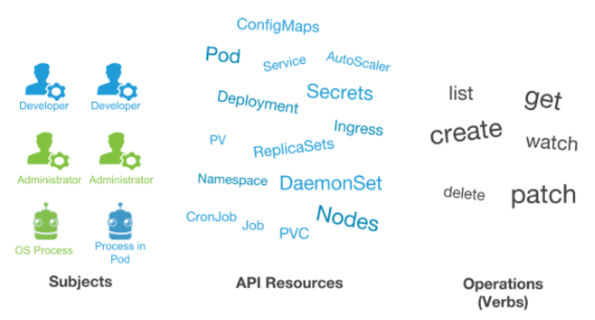
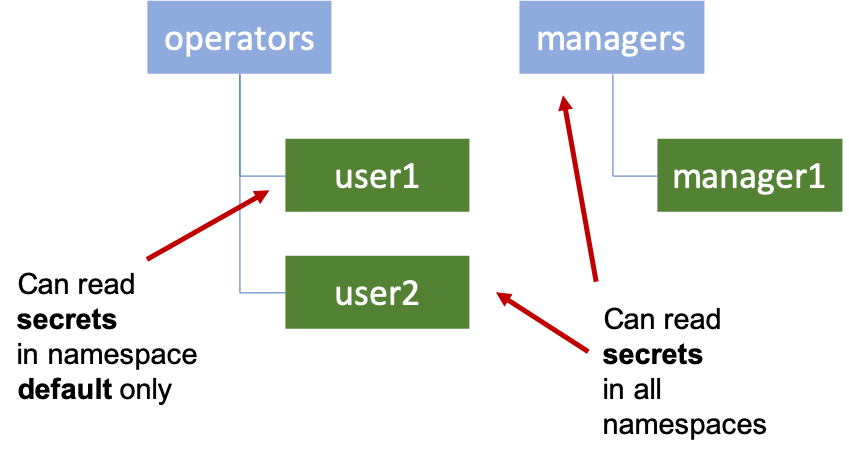

# Controlling user access using Role Based Access Control (RBAC)

Role management provides the necessary framework for enterprises for effective access governance of sensitive data and it is also recognized as the best practice for strict control of employee’s lifecycle.

In Kubernetes' RBAC, we can:

* Have multiple users with different properties, establishing a proper authentication mechanism.
* Have full control over which operations each user or group of users can execute.
* Have full control over which operations each process inside a pod can execute.
* Limit the visibility of certain resources of namespaces.



Kubernetes objects associated with RBAC:

* **Roles**

  A `Role` can only be used to grant access to resources within a single namespace

* **ClusterRoles**
  
  A `ClusterRole` can be used to grant the same permissions as a Role, but because they are cluster-scoped, they can also be used to grant access to:
  * cluster-scoped resources (like nodes)
  * non-resource endpoints (like “/healthz”)
  * namespaced resources (like pods) across all namespaces (needed to run kubectl get pods --all-namespaces, for example)

* **RoleBindings**

  A `RoleBinding` grants the permissions defined in a role to a user or set of users

* **ClusterRoleBindings**
  
  Similar to `RoleBinding` but cluster-scoped

## Demo - Prequisities

As a prerequisite to demonstrate access control, we are going to:

1. Create 2 secrets, `jonsnow` and `dany`, placed in namespace `default` and `default2` respectively.
   
2. Create 3 users (certificate and key pairs): `user1` and `user2` which belongs to group `operators` and `manager1` which belongs to group `managers`.
   

### Create Namespace and Secrets

Create a new namespace `default2`

```console
$ kubectl create namespace default2
namespace/default2 created
```

Create secret `jonsnow` in namespace `default`

```console
$ kubectl create secret generic jonsnow --from-literal=username=jon --from-literal=password=backtothenorth -n default
secret/jonsnow created
$ kubectl get secret
NAME                  TYPE                                  DATA   AGE
default-token-x7hpm   kubernetes.io/service-account-token   3      2d18h
jonsnow               Opaque                                2      4s
```

Create secret `dany` in namespace `default2`

```console
$ kubectl create secret generic dany --from-literal=username=dany --from-literal=password=themadqueen -n default2
secret/dany created
$ kubectl get secret -n default2
NAME                  TYPE                                  DATA   AGE
dany                  Opaque                                2      5s
default-token-ht7gn   kubernetes.io/service-account-token   3      54s
```

### Create Users

Check if `ca.crt` and `ca.key` exists. These are the minikube CA certificate and key which will be used to sign users' certificates.

```console
$ ls ~/.minikube | grep ^ca.*
ca.crt # <-- make sure this exists
ca.key # <-- make sure this exists
ca.pem
cache
```

Load utility scripts

```console
source utils.sh
```

Generate key and certificate for `user1` using the utility script. Note that in Kubernetes context, `CN` represents the name and `O` represents the group

```console
$ create_user user1 operators
Generating RSA private key, 2048 bit long modulus
................................................................+++
....................................................................................+++
e is 65537 (0x10001)
Signature ok
subject=/CN=user1/O=operators
Getting CA Private Key
```

Set user and create context for `user1`

```console
$ kubectl config set-credentials user1 --client-certificate=user1.crt --client-key=user1.key
User "user1" set.
$ kubectl config set-context user1-context --cluster=minikube --namespace=default --user=user1
Context "user1-context" created.
```

Generate key and certificate for `user2` using the utility script

```console
$ create_user user2 operators
Generating RSA private key, 2048 bit long modulus
..................................................................+++
.....................+++
e is 65537 (0x10001)
Signature ok
subject=/CN=user2/O=operators
Getting CA Private Key
```

Set user and create context for `user2`

```console
$ kubectl config set-credentials user2 --client-certificate=user2.crt --client-key=user2.key
User "user2" set.
$ kubectl config set-context user2-context --cluster=minikube --namespace=default --user=user2
Context "user2-context" created.
```

Generate key and certificate for `manager1` using the utility script

```console
$ create_user manager1 managers
Generating RSA private key, 2048 bit long modulus
.........+++
......................................................+++
e is 65537 (0x10001)
Signature ok
subject=/CN=manager1/O=managers
Getting CA Private Key
```

Set user and create context for `manager1`

```console
$ kubectl config set-credentials manager1 --client-certificate=manager1.crt --client-key=manager1.key
User "manager1" set.
$ kubectl config set-context manager1-context --cluster=minikube --namespace=default --user=manager1
Context "manager1-context" created.
```

View the configuration. There should be 3 *contextes* aka profiles which points to its respective users. We can switch profiles when interacting with the cluster, as shown in later steps.

```console
$ kubectl config view
...
- context:
    cluster: minikube
    namespace: default
    user: user1 # <-- reference to user1
  name: user1-context # <-- context name
- context:
    cluster: minikube
    namespace: default
    user: user2
  name: user2-context
- context:
    cluster: minikube
    namespace: default
    user: manager1
  name: manager1-context
...
- name: user1 <-- referred from user1-context
  user:
    client-certificate: /path/to/k8s-basics/08-rbac/user1.crt
    client-key: /path/to/k8s-basics/08-rbac/user1.key
- name: user2
  user:
    client-certificate: /path/to/k8s-basics/08-rbac/user2.crt
    client-key: /path/to/k8s-basics/08-rbac/user2.key
- name: manager1
  user:
    client-certificate: /path/to/k8s-basics/08-rbac/manager1.crt
    client-key: /path/to/k8s-basics/08-rbac/manager1.key
```

## Demo - Role and RoleBinding

Create Role `secret-reader`, which specifies *read-only* access to `secrets` in namespace `default`

```console
$ kubectl config use-context minikube
Switched to context "minikube".
$ kubectl create -f role.yaml
role.rbac.authorization.k8s.io/secret-reader created
```

Create RoleBinding `read-secrets`, which binds the Role `secret-reader` to User `user1` in namespace `default` (Observe the `subjects` section in the yaml file)

```console
$ kubectl create -f role-binding.yaml
rolebinding.rbac.authorization.k8s.io/read-secrets created
```

Now switch context to `user1-context`, which means that we interact with the cluster as `user1`

```console
$ kubectl config use-context user1-context
Switched to context "user1-context".
$ kubectl config current-context
user1-context
```

Try to view secrets in the namespace `default` and it is successful, as `user1` is given the access to read Secret in namespace `default`

```console
$ kubectl get secret -n default
NAME                  TYPE                                  DATA   AGE
default-token-x7hpm   kubernetes.io/service-account-token   3      2d18h
jonsnow               Opaque                                2      2m30s
```

However when `user1` tries to see secrets in the namespace `default2`, the cluster rejects as `user` is not given access to read Secret in namespace `default2`

```console
$ kubectl get secret -n default2
Error from server (Forbidden): secrets is forbidden: User "user1" cannot list resource "secrets" in API group "" in the namespace "default2"
```

## Demo - ClusterRoleBinding

Create ClusterRole `secret-reader`, which specifies *read-only* access to `secrets` in **all** namespaces. Note we need to switch back to `minikube` context to do this

```console
$ kubectl config use-context minikube
Switched to context "minikube".
$ kubectl create -f cluster-role.yaml
clusterrole.rbac.authorization.k8s.io/secret-reader created
```

Create ClusterRoleBinding `read-secrets-global`, which binds the ClusterRole `secret-reader` to:

* User `user2`
* Group `managers` (`manager1` is part of this group)

```console
$ kubectl create -f cluster-role-binding.yaml
clusterrolebinding.rbac.authorization.k8s.io/read-secrets-global created
```

Switch to `user2`

```console
$ kubectl config use-context user2-context
Switched to context "user2-context".
$ kubectl config current-context
user2-context
```

`user2` can view secrets in **all** namespaces as ClusterRole is used

```console
$ kubectl get secret -n default
NAME                  TYPE                                  DATA   AGE
default-token-x7hpm   kubernetes.io/service-account-token   3      2d18h
jonsnow               Opaque                                2      3m43s
$ kubectl get secret -n default2
NAME                  TYPE                                  DATA   AGE
dany                  Opaque                                2      3m30s
default-token-ht7gn   kubernetes.io/service-account-token   3      4m19s
```

`user2` cannot create secrets, as the permission is only to read

```console
$ kubectl create secret generic bran --from-literal=username=bran --from-literal=password=didnothing -n default
Error from server (Forbidden): secrets is forbidden: User "user2" cannot create resource "secrets" in API group "" in the namespace "default"
```

Switch to `manager1`. Note that manager1 belongs to group `managers`.

```console
$ kubectl config use-context manager1-context
Switched to context "manager1-context".
$ kubectl config current-context
manager1-context
```

`manager1` is able to view secrets in all namespaces, as it belongs to group `managers`, which is given read access to secrets in all namespaces

```console
$ kubectl get secret -n default
NAME                  TYPE                                  DATA   AGE
default-token-x7hpm   kubernetes.io/service-account-token   3      2d18h
jonsnow               Opaque                                2      4m42s
$ kubectl get secret -n default2
NAME                  TYPE                                  DATA   AGE
dany                  Opaque                                2      4m37s
default-token-ht7gn   kubernetes.io/service-account-token   3      5m26s
```

## Clean up

```console
$ kubectl config use-context minikube
$ kubectl delete secret jonsnow -n default && kubectl delete secret dany -n default2
$ kubectl delete -f role.yaml -f role-binding.yaml -f cluster-role.yaml -f cluster-role-binding.yaml
role.rbac.authorization.k8s.io "secret-reader" deleted
rolebinding.rbac.authorization.k8s.io "read-secrets" deleted
clusterrole.rbac.authorization.k8s.io "secret-reader" deleted
clusterrolebinding.rbac.authorization.k8s.io "read-secrets-global" deleted
$ kubectl delete ns default2
namespace "default2" deleted
$ kubectl config delete-context user1-context && kubectl config delete-context user2-context && kubectl config delete-context manager1-context
deleted context user1-context from /path/to/.kube/config
deleted context user2-context from /path/to/.kube/config
deleted context manager1-context from /path/to/.kube/config
$ kubectl config unset users.user1 && kubectl config unset users.user2 && kubectl config unset users.manager1
Property "users.user1" unset.
Property "users.user2" unset.
Property "users.manager1" unset.
$ rm user1.* user2.* manager1.*
```

## References

* [RBAC with Kubernetes in Minikube](https://medium.com/@HoussemDellai/rbac-with-kubernetes-in-minikube-4deed658ea7b)
* <https://kubernetes.io/docs/reference/access-authn-authz/rbac/>